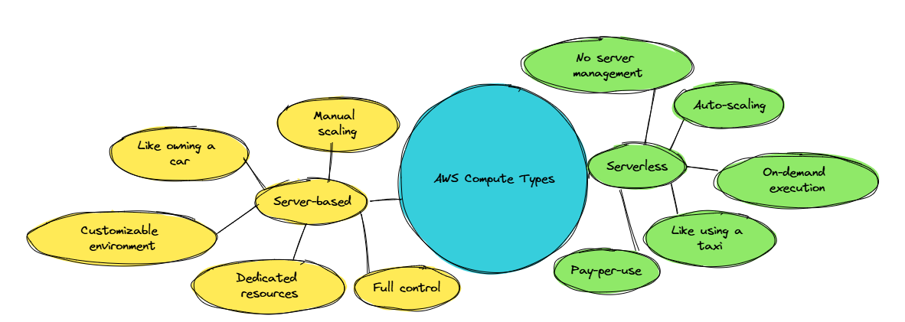

#  Concepts of AWS

Cloud journey with **Amazon Web Services (AWS)** — the world’s most comprehensive and broadly adopted cloud platform.

---

## Section one:  Why is AWS a Big Deal?

-  **Market Leader** in cloud computing
-  Trusted by millions of customers
-  Offers over **200 fully featured services**
-  Used globally across industries for web hosting, data analytics, app development, and much more

[View Cloud Market Share Stats](https://www.statista.com/chart/18819/worldwide-market-share-of-leading-cloud-infrastructure-service-providers/)

---

## What Can You Do With AWS?

- Host websites and applications  
- Store, process, and analyze data  
- Develop scalable and secure apps/services  

---

##  AWS Core Service Domains

AWS provides a foundation built on **four core service domains**:

### 

### 1.  **Compute** – The Powerhouse Star
- Executes your applications and data workflows
- Enables tasks like:
  - Running web servers or backend logic
  - Performing computations
  - Handling user requests

### 2.  **Storage** – The Vast Cosmic Vault
- Stores data for short-term or long-term needs
- Use cases include:
  - File backups
  - Temporary cache
  - Long-term archives

### 3.  **Database** – The Grand Librarian
- Structures data for easy querying
- Enables:
  - Real-time lookups
  - Historical data tracking

### 4.  **Networking** – The Cosmic Webways
- Ensures smooth and secure communication
- Handles:
  - Data transfer between services
  - Secure connections

---

## How These Services Work Together (Use Case Example)

 **E-commerce Platform**:
- **Compute**: Processes searches, payments, and user sessions
- **Storage**: Holds product images, reviews, and order history
- **Database**: Manages product listings, user data, and inventory
- **Networking**: Ensures secure, fast access & external system integration (e.g., payment gateways)

---

## AWS Global Architecture

AWS operates on a **global infrastructure** for high performance, fault tolerance, and scalability.

### 

### Components:
- **Data Centers**: High-speed compute & storage hubs
- **Availability Zones (AZs)**:
  - Isolated units within regions
  - Provide redundancy and fault tolerance
- **Edge Locations**:
  - 400+ worldwide
  - Support AWS CloudFront for ultra-fast content delivery

###  **Black Friday Example**:
- Data Centers handle traffic surge
- AZs ensure no service interruption
- Edge Locations deliver content fast to global customers

---

## Till Now Summary

- AWS is the dominant cloud platform used globally
- Core service domains: Compute, Storage, Database, Networking
- These services interact seamlessly to power modern apps
- AWS’s global infrastructure ensures availability, speed, and security

---

# Section Two: Fundamentals of Cloud Computing and AWS Core Services

Cloud computing is the **backbone of modern digital infrastructure**. This section explains the core ideas and how AWS provides scalable services in three main categories: Compute, Storage, and Databases.

---

##  What is Cloud Computing?

Cloud computing offers **on-demand IT resources**—like servers, storage, databases, and networking—without needing to own or manage physical hardware.

Think of it like a digital kitchen:
- **Compute** = Head Chef (handles all processing)
- **Storage** = Pantry/Fridge (where your data lives)
- **Database** = Recipe Book (organized and queryable data)

---

##  AWS Compute Services

AWS compute services offer **processing power** either as traditional servers or on-demand serverless execution.

### 

### Server-Based (e.g., EC2)
- Like owning a car: full control, more responsibility
- Dedicated servers
- Ideal for applications requiring full system access

### Serverless (e.g., Lambda)
- Like hailing a taxi: use it when you need it
- No server management
- Runs automatically on events (e.g., file uploads, database updates)

#### 🔍 Real-Life Examples
- **EC2**: Hosting websites, backend servers
- **Lambda**: Image resizing, API event triggers

---

##  AWS Storage Services

AWS offers flexible storage options based on **access frequency and purpose**.

### 

### Active Storage – Amazon S3
- Highly available and scalable
- Ideal for website hosting, data backups, content delivery

### Archival Storage – Amazon Glacier
- Designed for rarely accessed data
- Perfect for long-term backups and historical archives

#### 🔍 Real-Life Examples
- **S3**: Static website hosting, real-time analytics data
- **Glacier**: Compliance logs, historical archives

---

##  AWS Database Services

Databases allow structured storage and efficient querying of data. AWS provides two main types:

### 

### Relational Databases (RDS)
- SQL-based
- Structured, table-based
- Best for traditional apps like e-commerce or financial systems

### NoSQL Databases (DynamoDB)
- Schema-less, key-value store
- High-speed and flexible
- Best for gaming, IoT, or real-time apps

####  Real-Life Examples
- **RDS**: Payment processing, inventory management
- **DynamoDB**: Leaderboards, ad bidding systems

To Learn more: [AWS Database Products](https://aws.amazon.com/products/databases/)

---

## Section Two Summary:

- Cloud computing powers apps and services through **scalable, on-demand infrastructure**
- AWS compute services include both **EC2 (server-based)** and **Lambda (serverless)**
- AWS offers **S3 for active storage** and **Glacier for archival storage**
- AWS database options include **RDS for structured data** and **DynamoDB for fast, flexible NoSQL storage**

---

# Section Three: AWS Security, Pricing & Analytics

As you scale up cloud adoption, understanding **how to secure, optimize, and analyze** AWS infrastructure is essential. This section covers **IAM**, **KMS**, **pricing strategies**, and **AWS data analytics tools** like Glue and Redshift.

---

## AWS Security & Compliance

AWS treats security as a **shared responsibility** between you and AWS. They provide powerful tools for managing identity, encryption, and defense mechanisms.

### 

### Identity and Access Management (IAM)
- Controls **who can access what**
- Ensures users are **authenticated** and **authorized**
- Acts like a **security gatekeeper**

### Key Management Service (KMS)
- Manages cryptographic keys
- Encrypts sensitive information
- Enables **data security and access control**

### AWS Shield – DDoS Protection
- **Standard**: Auto-protects against common DDoS attacks  
- **Advanced**: Includes 24/7 support & mitigation tools

### Compliance Standards
AWS adheres to global regulations such as:
- **HIPAA** (Healthcare)
- **GDPR** (Europe data protection)
- Offers resources for achieving your own compliance requirements

---

##  AWS Pricing and Cost Management

AWS gives you flexibility in cost control through several pricing models.

### 

### Pay-as-you-go
- No upfront costs
- Scale up/down based on usage
- Ideal for unpredictable workloads

### Savings Plans & Reserved Instances
- Long-term cost reduction
- Reserve compute capacity with better rates
- Best for **steady usage**

### Spot Instances
- Up to 90% cheaper
- Great for **interruptible** tasks (e.g., batch processing)

### AWS Cost Tools
- **Cost Explorer**: Visualize spending
- **Budgets**: Set custom limits and alerts

More info: [AWS Savings Plans](https://aws.amazon.com/savingsplans/)

---

##  Data Analytics in AWS

Data is only as valuable as the insights you extract. AWS provides powerful tools for **data warehousing and ETL** (Extract, Transform, Load).

### 

### Step 1: AWS Glue
- **Discovers** your data
- **Cleans and prepares** it for analysis
- Acts as the ETL engine

### Step 2: Amazon Redshift
- Scalable **data warehouse**
- Optimized for **fast, SQL-based analysis**

### Step 3: Run Analytics
- Query your prepared data
- Track **usage patterns**, **costs**, and **security risks**

---

##  How It All Ties Together

- **Compute**: EC2/Lambda run your analytics workloads
- **Storage**: S3/Glacier house the raw and processed data
- **Global Infrastructure**: Regions, AZs, and Edge Locations enhance performance
- **Analytics**: Provides insights for **security auditing** and **cost efficiency**

---

## Section Three Summary

- IAM and KMS provide robust **security management**
- AWS pricing offers models for **cost flexibility and optimization**
- Glue and Redshift power **data analytics pipelines**
- Analytics supports security, compliance, and cost savings

---

## Recap

- Understanding the AWS Core Domains
- Explored Compute (EC2, Lambda), Storage (S3, Glacier), and Database (RDS, DynamoDB)
- Know how Security, Pricing, and Analytics work in AWS
